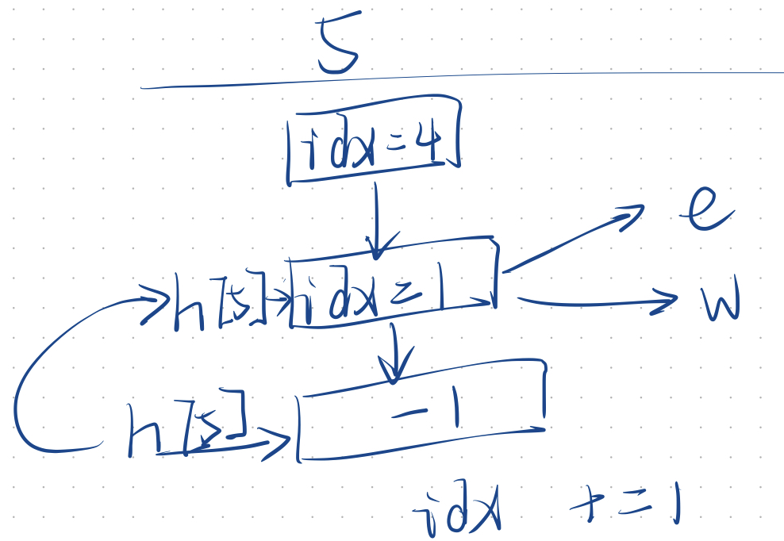

# Target


# 重点

## 1、定义并初始化一维数组

```c
int len = strlen(s);
const int MAX = len + 1;
int *f = (int *)malloc(sizeof(int) * MAX);
memset(f, 0, sizeof(int) * MAX);
```

两种初始化方式

```c
#include<stdio.h>
#include<stdlib.h>
#include<string.h>
#define MAX 10
#define inf 0x3f3f3f3f

int main(){
    int* f = (int*)malloc(sizeof(int) * MAX);
    memset(f, 0, sizeof(int) * MAX);
    for(int i = 0; i < MAX; i++)
        printf("%d ", f[i]);

    puts("");

    int g[MAX];
    memset(g, inf, sizeof g);
    for(int i = 0; i < MAX; i++)
        printf("%d ", g[i]);
}
```

## 2、定义并初始化二维数组

```c
int **arr2(int row, int col, int val){
    int** a = (int **)malloc(sizeof(int *) * row);
    for(int i = 0; i < row; i++)
        a[i] = (int *)malloc(sizeof(int) * col);
    for(int i = 0; i < row; i++)
        for(int j = 0; j < col; j++)
            a[i][j] = val;
    return a;
}
```

两种初始化方式

```c
#include<stdio.h>
#include<stdlib.h>
#include<string.h>
#define MAX 10
#define inf 0x3f3f3f3f

int **arr2(int row, int col, int val){
    int** a = (int **)malloc(sizeof(int *) * row);
    for(int i = 0; i < row; i++)
        a[i] = (int *)malloc(sizeof(int) * col);
    for(int i = 0; i < row; i++)
        for(int j = 0; j < col; j++)
            a[i][j] = val;
    return a;
}
int main(){
    int** f = arr2(MAX, MAX, 0);
    for(int i = 0; i < MAX; i++){
        for(int j = 0; j < MAX; j++)
            printf("%d ", f[i][j]);
        puts("");
    }

    puts("");

    int g[MAX][MAX];
    memset(g, inf, sizeof g);
    for(int i = 0; i < MAX; i++){
        for(int j = 0; j < MAX; j++)
            printf("%d ", g[i][j]);
        puts("");
    }
}
```

## 3、快速排序

```c
#include<stdio.h>
#include <stdlib.h>
void quickSort(int* arr, int l, int r){
    if(l >= r) return;
    int x = arr[l], i = l - 1, j = r + 1;
    while(i < j){
        do i++; while(arr[i] < x);
        do j--; while(arr[j] > x);
        if(i < j){
            int temp = arr[i];
            arr[i] = arr[j];
            arr[j] = temp;
        }
    }
    quickSort(arr, l, j);
    quickSort(arr, j + 1, r);
}
int main(){
    const int MAX = 100001;
    int *arr = (int*)malloc(sizeof(int) * MAX);
    int n;
    scanf("%d", &n);
    for(int i = 0; i < n; i++) scanf("%d", &arr[i]);
    quickSort(arr, 0, n - 1);
    for(int i = 0; i < n; i++) printf("%d ", arr[i]);
}
```

```c
#include<stdio.h>
#include<stdlib.h>
#include<string.h>
static int cmp(const void *pa, const void *pb) {
    return *(int *)pa - *(int *)pb;
}

int main(){
    int MAX = 100;
    int* f = (int*)malloc(sizeof(int) * MAX);
    memset(f, 0, sizeof(int)*MAX);

    int len;
    scanf("%d", &len);

    for(int i = 0; i < len; i++)
        scanf("%d", &f[i]);

    qsort(f, len, sizeof(int), cmp);
    for(int i = 0; i < len; i++)
        printf("%d ", f[i]);
}
```


## 4、归并排序

```c
#include<stdio.h>
#include <stdlib.h>
const int MAX = 100001;
void mergeSort(int* arr, int l, int r){
    int *tmp = (int*)malloc(sizeof(int) * MAX);
    if(l >= r) return;
    int mid = (l + r) / 2;
    mergeSort(arr, l, mid), mergeSort(arr, mid + 1, r);
    int k = 0, i = l, j = mid + 1;
    while (i <= mid && j <= r)
        if(arr[i] <= arr[j]) tmp[k++] = arr[i++];
        else tmp[k++] = arr[j++];
    while(i <= mid) tmp[k++] = arr[i++];
    while(j <= r) tmp[k++] = arr[j++];
    for(i = l, j = 0; i <= r; i++, j++) arr[i] = tmp[j];
    
}
int main(){
    int *arr = (int*)malloc(sizeof(int) * MAX);
    int n;
    scanf("%d", &n);
    for(int i = 0; i < n; i++) scanf("%d", &arr[i]);
    mergeSort(arr, 0, n - 1);
    for(int i = 0; i < n; i++) printf("%d ", arr[i]);
}
```

## 5、二分查找

```C
int bSearch_1(int l, int r){
    while(l < r){
        int mid = (l + r + 1) >> 1;
        /** check(mid)
         * true     [mid,       r] → ∵ 避免死循环[l, r] ∴  mid = (l + r + 1) / 2
         * false    [l  , mid - 1]
        */
        if(check(mid)) l == mid; // l == mid → 偏右; 否则 l + r / 2 == l → 死循环
        else r = mid - 1;
    }
    return l;
}

int bSearch_2(int l, int r){
    while(l < r){
        int mid = (l + r) >> 1;
        /** check(mid)
         * true     [l      , mid]
         * false    [mid + 1,   r]
        */
        if(check(mid)) r == mid; // r == mid → 偏左
        else l = mid + 1;
    }
    return l;
}
```

## 6、C语言读取字符串

```C
op = (char*)malloc(sizeof(char) * 3), memset(len, 0, sizeof(char)*3);
scanf("%s", op);
int a, b;
if (op[0] == 'C') {
    scanf("%d %d", &a, &b);
    if (!check(a, b))
        merge(a, b);
}
else if (op[0] == 'Q' && op[1] == '1') {    //查询是否在同一个集合
    scanf("%d %d", &a, &b);
    check(a, b) ? printf("Yes\n") : printf("No\n");
}else if(op[0] == 'Q' && op[1] == '2') {                   //查询一个集合有多少个元素
    scanf("%d", &a);
    printf("%d\n", len[find(a)]);
}
```

## 7、C语言数组模拟哈希拉链法

```c
int *val, *nex, *head;  // val:idx结点具体值、nex:idx下一个值、head: 对应Key的拉链头
val  = (int*)malloc(sizeof(int) * N), memset(val, 0, sizeof(int) * N);
nex  = (int*)malloc(sizeof(int) * N), memset(nex, 0, sizeof(int) * N);
head = (int*)malloc(sizeof(int) * N), memset(head, -1, sizeof(int) * N);
void insert(int x){
    int k = (x % N + N) % N;
    val[idx] = x;
    nex[idx] = head[k];
    head[k] = idx;
    idx ++ ;
}
```

## 8、C语言特性 Const

`const` 只能说明仅读，不代表声明常数。因此不可以用来作为数组变量

==注意==：`define` 前加`＃`后去`;`

```c
//错误示例：
int array_length = 100;
#define MAX_LENGTH array_length 
int array_wrong[array_length];			//由于数组长度array_length为变量，因此错误
int array_wrong[MAX_LENGTH];			//由于数组长度MAX_LENGTH为变量array_length，因此错误

//正确示例
#define MAX_LENGTH 100
int array_success[MAX_LENGTH];		//由于数组长度MAX_LENGTH为常量100，因此正确
```

## 9、字符串哈希

```c
#include<stdio.h>
#include<stdlib.h>
typedef unsigned long long ULL;
const int P = 131;                        // 这里P取131 / 13331 为经验值，可以使得不用考虑冲突的情况
#define N 100010
char str[N];                              // str这里是输入的字符串，同时使用ASCII值
ULL hash[N], pM[N];                       // hash为前n个字母的哈希值，pM为p的n次幂
// 求l-r区间内的哈希值
ULL get(int l,int r){
    return hash[r] - hash[l-1] * pM[r-l+1];
}

int main(){
    int n, m;
    scanf("%d %d %s", &n, &m, str + 1);
    pM[0] = 1;
    //求P的n次幂和前n个字符的哈希值
    for(int i = 1; i <= n; i++){
        pM[i] = pM[i-1] * P;
        hash[i] = hash[i-1] * P + str[i]; 
    }
    while(m--){
        int l1,r1,l2,r2;
        scanf("%d %d %d %d", &l1, &r1, &l2, &r2);
        if(get(l1,r1) == get(l2,r2))
            puts("Yes");
        else
            puts("No");
    }
}
```

## 10、BFS



```c
#include <stdio.h>
#include <stdlib.h>
#include <string.h>

#define N 10010
int n, m;                         // 输入参数  →  全局变量
int h[N], d[N], e[N], ne[N], idx; // head  →  起点链表, d  →  距离, e  →  终点链表, next  →  结点链表
int q[N];

int hh = 1, tt = 0, ss = 0; // heap, tail, size
void add(int a, int b)
{
    e[idx] = b;     // idx  edge    指向    汇点b
    ne[idx] = h[a]; // idx  next    指向    旧头结点 head
    h[a] = idx;     // a    head    指向    新头结点 idx
    idx++;          // idx          更新    新结点
}

int bfs()
{
    tt += 1, q[tt] = 1, ss += 1;        // 数组模拟队列  入尾操作
    d[1] = 0;                           // 起始点 距离赋值 0

    while (ss)
    {
        int t;
        t = q[hh], hh += 1, ss -= 1;                     // 数组模拟队列  取头操作

        for (int i = h[t]; i != -1; i = ne[i])
        {
            int j = e[i];
            if (d[j] == -1)                              // 未遍历过
            {
                d[j] = d[t] + 1;                        // d[j] = d[t] + 1
                tt += 1, q[tt] = j, ss += 1;            // j加入队列
            }
        }
    }
    return d[n];
}

int bfs()
{
    int hh = 0, tt = 0;
    q[tt++] = 1;
    d[1] = 0;

    while (hh != tt)
    {
        int t = q[hh++];
        for (int i = h[t]; i != -1; i = ne[i])
        {
            int j = e[i];
            if (d[j] == -1)
            {
                d[j] = d[t] + 1;
                q[tt++] = j;
            }
        }
    }
    return d[n];
}

int main()
{
    scanf("%d %d", &n, &m);
    memset(h, -1, sizeof(int) * N); // 初始化h数组 -1表示空
    memset(d, -1, sizeof(int) * N); // 初始化d数组 -1表示空
    for (int i = 0; i < m; i++)
    {
        int a, b;
        scanf("%d %d", &a, &b);
        add(a, b);
    }
    printf("%d\n", bfs());
}
```

## 11、DFS

```C
#include<stdio.h>
#include<stdlib.h>
#include<string.h>
#define N 10
int n;
int path[N] = {0}, st[N] = {0};
void dfs(int u){
    // 区间 : [0, n-1]
    if (u == n){
        for (int i = 0; i < n; i ++ )
            printf("%d ",path[i]);
        puts("");
        return;
    }
    for (int i = 1; i <= n; i ++ ){
        //如果没有使用过
        if (st[i] == 0){ 
            path[u] = i ;       // 填入没有被使用过的数字
            st[i] = 1;          // 标记为使用了
            dfs(u + 1);         // 进行下一个位置的计算
            path[u] = 0;        // 回溯复原
            st[i] = 0;          // 回溯复原
        }
    }
}
int main(){
    scanf("%d", &n);
    dfs(0);
}
```


```c
#include<stdio.h>
#include<stdlib.h>
#include<string.h>
#define N 20

int n;
char g[N][N];
int col[N] = {0}, dg[N] = {0}, udg[N] = {0};
void dfs(int u){
    // 区间 : [0, n-1]
    if (u == n){
        for (int i = 0; i < n; i ++ )
            printf("%s\n", g[i]);
        puts("");
        return;
    }

    for (int i = 0; i < n; i ++ ) //按行遍历
        /**
        X >= 0 && Y >= 0    y = x + b  || y = -x + b
        →  b1 = x + y || b2 = -x + y
        ∵ b2 = y - x 可能小于 0 → +n
        ∴ b1 = x + y, b2 = y - x + n

        */
        if (!col[i] && !dg[u + i] && !udg[n - u + i]){
            g[u][i] = 'Q';
            col[i] = dg[u + i] = udg[n - u + i] = 1;        // 标记
            dfs(u + 1);                                     // 递归下一层
            col[i] = dg[u + i] = udg[n - u + i] = 0;        // 恢复
            g[u][i] = '.';
        }
}

int main(){
    scanf("%d", &n);
    for (int i = 0; i < n; i ++ )
        for (int j = 0; j < n; j ++ )
            g[i][j] = '.';
    dfs(0);
}
```


## 12、Dijkstra

```c
/*Dijkstra求最短路 I（朴素版Dijkstra算法 时间复杂度 O(n ^ 2)*/
#include<stdio.h>
#include<stdlib.h>
#include<string.h>
#define N 510
#define inf 0x3f3f3f3f
int n, m;
int g[N][N];            // 存储稠密图,用邻接矩阵
int dist[N];            // 表示起点到每一个点当前距离是多少
int st[N];              // 用于在更新最短距离时 判断当前的点的最短距离是否确定 是否需要更新

int min(int a, int b){
    return a < b ? a : b;
}

int dijkstra() {
    memset(dist, inf, sizeof dist);     // 初始化距离  0x3f 代表无限大
    dist[1] = 0;                        // 第一个点到自身的距离为 0
    /*
        t 存储当前迭代目标结点
        遍历所有结点  →  [1, n]
        选取边距离最小节点加入, 并将该结点标记为已访问
    */
    for(int i = 0; i < n; i++) {
        int t = -1;
        for (int j = 1; j <= n; j++) {
            // t == -1 → 初始情况
            // dist[j] < dist[t]  →  更新短边
            if(st[j] == 0 && (t == -1 || dist[j] < dist[t]))
                t = j;                  //将t更新为j
        }
        st[t] = 1;                      // 标记该点已访问

        /*
            添加结点t, 并更新边距离信息
            j [1, n]  dist(j) = min(j, min(t) + g[t][j])
            到结点 j 距离 → min(未加入t结点时距离, 到t结点距离 + t → j距离)
        */
        for(int j = 1; j <= n; j++)
            dist[j] = min(dist[j], dist[t] + g[t][j]);
    }
    //如果第n个点路径为无穷大即不存在最低路径
    if(dist[n] == inf)
        return -1;
    return dist[n];
}
int main()
{
    scanf("%d %d", &n, &m);
    memset(g, inf, sizeof g);                // 初始化结点边为最大值
    
    while (m--) {
        int x, y, z;
        scanf("%d %d %d", &x, &y, &z);
        g[x][y] = min(g[x][y], z);          // 出现重边 → 保留短边
    }
    printf("%d\n", dijkstra());
}
```

## 13、BellmanFord

```c
/* BellmanFord算法  负权 + 自环 + 重边 + 限定K条边*/
#include <stdio.h.>
#include <string.h>
#include <stdlib.h>
#define N 510
#define M 10010

struct Edge
{
    int a, b, c;        // 源点, 汇点, 权值
} edges[M];
int n, m, k;            // 全局 输入变量
int dist[N];            // 距离 初始化最大值
int last[N];            // 存储备份  →  避免更新后 原数据丢失

int min(int a, int b)
{
    return a < b ? a : b;
}

void bellman_ford()
{
    memset(dist, 0x3f, sizeof dist);
    dist[1] = 0;                                                // 起始点 赋0
    for (int i = 0; i < k; i++)                                 // 要求至多 K条边 故遍历K次
    {
        memcpy(last, dist, sizeof dist);
        for (int j = 0; j < m; j++)
        {
            struct Edge e = edges[j];
            dist[e.b] = min(dist[e.b], last[e.a] + e.c);
        }
    }
}
int main()
{
    scanf("%d %d %d", &n, &m, &k);
    for (int i = 0; i < m; i++)
    {
        int a, b, c;
        scanf("%d %d %d", &a, &b, &c);
        edges[i].a = a;
        edges[i].b = b;
        edges[i].c = c; // 存边和权值
    }
    bellman_ford();
    if (dist[n] > 0x3f3f3f3f / 2)
        puts("impossible");
    else
        printf("%d\n", dist[n]);
}
```

## 14、SPFA

```c
/*SPFA算法————负边权情况  时间复杂度  一般O(m) 最坏O(m * n)*/
/*优化Bellman  →  采用队列, 只更新已经更新过的边*/
#include <stdio.h>
#include <stdlib.h>
#include <string.h>
#define N 150010
#define inf 0x3f3f3f3f

int n, m;                         // 输入参数  →  全局变量
int h[N], w[N], e[N], ne[N], idx; // head  →  起点链表, weight  →  边权重, e  →  终点链表, next  →  结点链表
int dist[N];                      // 最短距离  →  初始化 INF
int st[N];                        // 是否访问
int q[N];
int hh = 1, tt = 0, ss = 0; // heap, tail, size

void add(int a, int b, int c)
{
    e[idx] = b;     // idx  edge    指向    汇点b
    w[idx] = c;     // idx  weight  指向    权重w
    ne[idx] = h[a]; // idx  next    指向    旧头结点 head
    h[a] = idx;     // a    head    指向    新头结点 idx
    idx++;          // idx          更新    新结点
}

int spfa()
{
    memset(dist, 0x3f, sizeof dist);
    dist[1] = 0, st[1] = 1;                 // 起始点 距离赋值 0, 访问标记 1
    tt += 1, q[tt] = 1, ss += 1;            // 数组模拟队列  入尾操作 
    
    while (ss)
    {
        int t;
        t = q[hh], hh += 1, ss -= 1;                     // 数组模拟队列  取头操作  
        st[t] = 0;                                       // 当前点 访问标记 1
        for (int i = h[t]; i != -1; i = ne[i])           // 遍历  t结点  所有彼边
        {
            int j = e[i];
            if (dist[j] > dist[t] + w[i])                // 距离较小  &&  未访问过  →  队列入尾
            {
                dist[j] = dist[t] + w[i];
                if (st[j] == 0)
                {
                    tt += 1, q[tt] = j, ss += 1;
                    st[j] = 1;
                }
            }
        }
    }
    return dist[n];
}
int main()
{
    scanf("%d %d", &n, &m);
    memset(h, -1, sizeof h);
    while (m--)
    {
        int a, b, c;
        scanf("%d %d %d", &a, &b, &c);
        add(a, b, c);
    }
    int t = spfa();
    if (t == 0x3f3f3f3f)
        puts("impossible");
    else
        printf("%d\n", t);
}
```

## 15、Floyd

```c
#include <stdio.h.>
#include <string.h>
#include <stdlib.h>
#define N 210
#define INF 100000010
int n, m, Q;
int d[N][N];

int min(int a, int b)
{
    return a < b ? a : b;
}

void floyd()
{
    for (int k = 1; k <= n; k++)
        for (int i = 1; i <= n; i++)
            for (int j = 1; j <= n; j++)
                d[i][j] = min(d[i][j], d[i][k] + d[k][j]);
}
int main()
{
    scanf("%d %d %d", &n, &m, &Q);
    for (int i = 1; i <= n; i++)
        for (int j = 1; j <= n; j++)
            if (i == j)
                d[i][j] = 0;
            else
                d[i][j] = INF;
    while (m--)
    {
        int a, b, c;
        scanf("%d %d %d", &a, &b, &c);
        d[a][b] = min(d[a][b], c);
    }
    floyd();
    while (Q--)
    {
        int a, b;
        scanf("%d %d", &a, &b);
        int t = d[a][b];
        if (t > INF / 2)
            puts("impossible");
        else
            printf("%d\n", t);
    }
    return 0;
}
```

## 16、Prim


## 17、Kruskal


# LeetCode

| 题号 |     状况     |
| :--: | :----------: |
|  70  |      ✔       |
| 1342 |      ✔       |
| 746  |      ✔       |
| 198  |      ✔       |
| 213  |      ✔       |
|  91  | ✔ ❓ C != C++ |
| 1646 |      ✔       |
| 1043 |      ✔       |
| 139  |      ✔       |
| 1869 |      ✔       |
| 724  |      ✔       |

# AcWing

| 题号 | 状况 |
| :--: | :--: |
| 789  |  ✔   |
| 797  |  ✔   |
| 798  |  ✔   |
| 799  |  ✔   |
| 801  |  ✔   |
|      |      |
|      |      |
|      |      |
|      |      |

