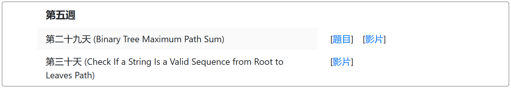

# Target





# 重点

## 1、定义并初始化一维数组

```c
int len = strlen(s);
const int MAX = len + 1;
int *f = (int *)malloc(sizeof(int) * MAX);
memset(f, 0, sizeof(int) * MAX);
```

## 2、定义并初始化二维数组

```c
int **arr2(int row, int col, int val){
    int** a = (int **)malloc(sizeof(int *) * row);
    for(int i = 0; i < row; i++)
        a[i] = (int *)malloc(sizeof(int) * col);
    for(int i = 0; i < row; i++)
        for(int j = 0; j < col; j++)
            a[i][j] = val;
    return a;
}
```

## 3、快速排序

```c
#include<stdio.h>
#include <stdlib.h>
void quickSort(int* arr, int l, int r){
    if(l >= r) return;
    int x = arr[l], i = l - 1, j = r + 1;
    while(i < j){
        do i++; while(arr[i] < x);
        do j--; while(arr[j] > x);
        if(i < j){
            int temp = arr[i];
            arr[i] = arr[j];
            arr[j] = temp;
        }
    }
    quickSort(arr, l, j);
    quickSort(arr, j + 1, r);
}
int main(){
    const int MAX = 100001;
    int *arr = (int*)malloc(sizeof(int) * MAX);
    int n;
    scanf("%d", &n);
    for(int i = 0; i < n; i++) scanf("%d", &arr[i]);
    quickSort(arr, 0, n - 1);
    for(int i = 0; i < n; i++) printf("%d ", arr[i]);
}
```

30:49

# LeetCode

| 题号 |     完成     |
| :--: | :----------: |
|  70  |      ✔       |
| 1342 |      ✔       |
| 746  |      ✔       |
| 198  |      ✔       |
| 213  |      ✔       |
|  91  | ✔ ❓ C != C++ |
| 1646 |      ✔       |
| 1043 |      ✔       |
| 139  |      ✔       |
| 1869 |      ✔       |
| 724  |      ✔       |
