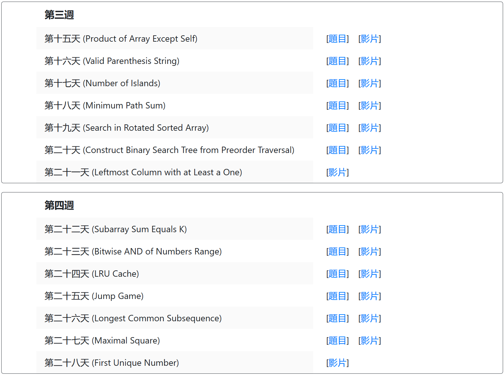

# Target





# 重点

## 1、定义并初始化一维数组

```c
int len = strlen(s);
const int MAX = len + 1;
int *f = (int *)malloc(sizeof(int) * MAX);
memset(f, 0, sizeof(int) * MAX);
```

## 2、定义并初始化二维数组

```c
int **arr2(int row, int col, int val){
    int** a = (int **)malloc(sizeof(int *) * row);
    for(int i = 0; i < row; i++)
        a[i] = (int *)malloc(sizeof(int) * col);
    for(int i = 0; i < row; i++)
        for(int j = 0; j < col; j++)
            a[i][j] = val;
    return a;
}
```

## 3、快速排序

```c
#include<stdio.h>
#include <stdlib.h>
void quickSort(int* arr, int l, int r){
    if(l >= r) return;
    int x = arr[l], i = l - 1, j = r + 1;
    while(i < j){
        do i++; while(arr[i] < x);
        do j--; while(arr[j] > x);
        if(i < j){
            int temp = arr[i];
            arr[i] = arr[j];
            arr[j] = temp;
        }
    }
    quickSort(arr, l, j);
    quickSort(arr, j + 1, r);
}
int main(){
    const int MAX = 100001;
    int *arr = (int*)malloc(sizeof(int) * MAX);
    int n;
    scanf("%d", &n);
    for(int i = 0; i < n; i++) scanf("%d", &arr[i]);
    quickSort(arr, 0, n - 1);
    for(int i = 0; i < n; i++) printf("%d ", arr[i]);
}
```

```c
#include<stdio.h>
#include<stdlib.h>
#include<string.h>
static int cmp(const void *pa, const void *pb) {
    return *(int *)pa - *(int *)pb;
}

int main(){
    int MAX = 100;
    int* f = (int*)malloc(sizeof(int) * MAX);
    memset(f, 0, sizeof(int)*MAX);

    int len;
    scanf("%d", &len);

    for(int i = 0; i < len; i++)
        scanf("%d", &f[i]);

    qsort(f, len, sizeof(int), cmp);
    for(int i = 0; i < len; i++)
        printf("%d ", f[i]);
}
```


## 4、归并排序

```c
#include<stdio.h>
#include <stdlib.h>
const int MAX = 100001;
void mergeSort(int* arr, int l, int r){
    int *tmp = (int*)malloc(sizeof(int) * MAX);
    if(l >= r) return;
    int mid = (l + r) / 2;
    mergeSort(arr, l, mid), mergeSort(arr, mid + 1, r);
    int k = 0, i = l, j = mid + 1;
    while (i <= mid && j <= r)
        if(arr[i] <= arr[j]) tmp[k++] = arr[i++];
        else tmp[k++] = arr[j++];
    while(i <= mid) tmp[k++] = arr[i++];
    while(j <= r) tmp[k++] = arr[j++];
    for(i = l, j = 0; i <= r; i++, j++) arr[i] = tmp[j];
    
}
int main(){
    int *arr = (int*)malloc(sizeof(int) * MAX);
    int n;
    scanf("%d", &n);
    for(int i = 0; i < n; i++) scanf("%d", &arr[i]);
    mergeSort(arr, 0, n - 1);
    for(int i = 0; i < n; i++) printf("%d ", arr[i]);
}
```

## 5、二分查找

```C
int bSearch_1(int l, int r){
    while(l < r){
        int mid = (l + r + 1) >> 1;
        /** check(mid)
         * true     [mid,       r] → ∵ 避免死循环[l, r] ∴  mid = (l + r + 1) / 2
         * false    [l  , mid - 1]
        */
        if(check(mid)) l == mid; // l == mid → 偏右; 否则 l + r / 2 == l → 死循环
        else r = mid - 1;
    }
    return l;
}

int bSearch_2(int l, int r){
    while(l < r){
        int mid = (l + r) >> 1;
        /** check(mid)
         * true     [l      , mid]
         * false    [mid + 1,   r]
        */
        if(check(mid)) r == mid; // r == mid → 偏左
        else l = mid + 1;
    }
    return l;
}
```

## 6、C语言读取字符串

```C
op = (char*)malloc(sizeof(char) * 3), memset(len, 0, sizeof(char)*3);
scanf("%s", op);
int a, b;
if (op[0] == 'C') {
    scanf("%d %d", &a, &b);
    if (!check(a, b))
        merge(a, b);
}
else if (op[0] == 'Q' && op[1] == '1') {    //查询是否在同一个集合
    scanf("%d %d", &a, &b);
    check(a, b) ? printf("Yes\n") : printf("No\n");
}else if(op[0] == 'Q' && op[1] == '2') {                   //查询一个集合有多少个元素
    scanf("%d", &a);
    printf("%d\n", len[find(a)]);
}
```

## 7、C语言数组模拟哈希拉链法

```c
int *val, *nex, *head;  // val:idx结点具体值、nex:idx下一个值、head: 对应Key的拉链头
val = (int*)malloc(sizeof(int) * N), memset(val, 0, sizeof(int) * N);
nex = (int*)malloc(sizeof(int) * N), memset(nex, 0, sizeof(int) * N);
head = (int*)malloc(sizeof(int) * N), memset(head, -1, sizeof(int) * N);
void insert(int x){
    int k = (x % N + N) % N;
    val[idx] = x;
    nex[idx] = head[k];
    head[k] = idx;
    idx ++ ;
}
```

## 8、C语言特性 Const

`const` 只能说明仅读，不代表声明常数。因此不可以用来作为数组变量

==注意==：`define` 前加`＃`后去`;`

```c
//错误示例：
int array_length = 100;
#define MAX_LENGTH array_length 
int array_wrong[array_length];			//由于数组长度array_length为变量，因此错误
int array_wrong[MAX_LENGTH];			//由于数组长度MAX_LENGTH为变量array_length，因此错误

//正确示例
#define MAX_LENGTH 100
int array_success[MAX_LENGTH];		//由于数组长度MAX_LENGTH为常量100，因此正确
```

## 9、字符串哈希

```c
#include<stdio.h>
#include<stdlib.h>
typedef unsigned long long ULL;
const int P = 131;                        // 这里P取131 / 13331 为经验值，可以使得不用考虑冲突的情况
#define N 100010
char str[N];                              // str这里是输入的字符串，同时使用ASCII值
ULL hash[N], pM[N];                       // hash为前n个字母的哈希值，pM为p的n次幂
// 求l-r区间内的哈希值
ULL get(int l,int r){
    return hash[r] - hash[l-1] * pM[r-l+1];
}

int main(){
    int n, m;
    scanf("%d %d %s", &n, &m, str + 1);
    pM[0] = 1;
    //求P的n次幂和前n个字符的哈希值
    for(int i = 1; i <= n; i++){
        pM[i] = pM[i-1] * P;
        hash[i] = hash[i-1] * P + str[i]; 
    }
    while(m--){
        int l1,r1,l2,r2;
        scanf("%d %d %d %d", &l1, &r1, &l2, &r2);
        if(get(l1,r1) == get(l2,r2))
            puts("Yes");
        else
            puts("No");
    }
}
```


# LeetCode

| 题号 |     状况     |
| :--: | :----------: |
|  70  |      ✔       |
| 1342 |      ✔       |
| 746  |      ✔       |
| 198  |      ✔       |
| 213  |      ✔       |
|  91  | ✔ ❓ C != C++ |
| 1646 |      ✔       |
| 1043 |      ✔       |
| 139  |      ✔       |
| 1869 |      ✔       |
| 724  |      ✔       |

# AcWing

| 题号 | 状况 |
| :--: | :--: |
| 789  |  ✔   |
| 797  |  ✔   |
| 798  |  ✔   |
| 799  |  ✔   |
| 801  |  ✔   |
|      |      |
|      |      |
|      |      |
|      |      |

